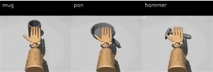
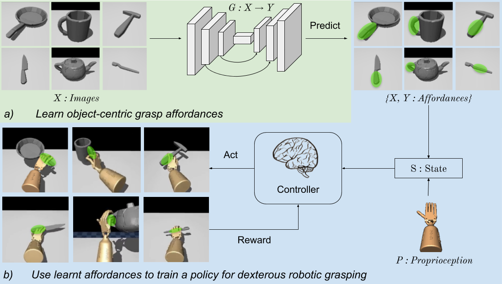
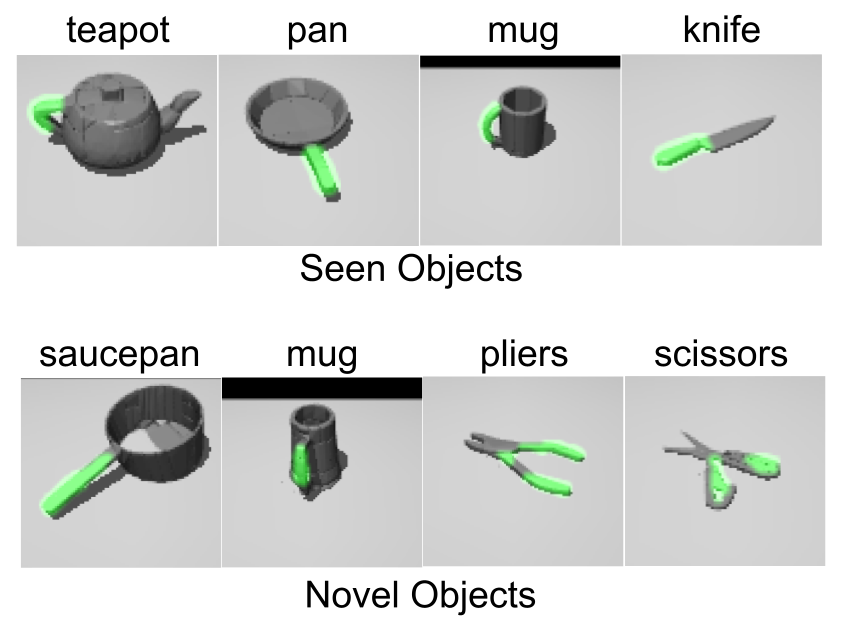
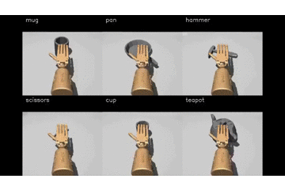

# GRAFF
This repository contains the source code for the paper [Learning Dexterous Grasping with Object-Centric Visual Affordances](https://vision.cs.utexas.edu/projects/graff-dexterous-affordance-grasp/).
Accepted at **International Conference on Robotics and Automation (ICRA), 2021**



## Citing this work
If you find this work useful in your research, please consider citing:
```
@inproceedings{mandikal2021graff,
  title = {Learning Dexterous Grasping with Object-Centric Visual Affordances},
  author = {Mandikal, Priyanka and Grauman, Kristen},
  booktitle = {IEEE International Conference on Robotics and Automation (ICRA)},
  year = {2021}
}
```

## Overview
GRAFF is a deep RL dexterous robotic grasping policy that uses visual affordance priors learnt from humans for functional grasping. Our proposed model, called GRAFF for Grasp-Affordances, consists of two stages. First, we train a network to predict affordance regions from static images. Second, we train a dynamic grasping policy using the learned affordances. The key upshots of our approach are better grasping, faster learning, and generalization to successfully grasp objects unseen during policy training. 



## Installation

#### Mujoco
1. Download MuJoCo v2.0 binaries from the official website: https://www.roboti.us/download.html.
2. Download the activation key from here: https://www.roboti.us/license.html 
3. Unzip the downloaded mujoco200 directory into ~/.mujoco/mujoco200, and copy the license key (mjkey.txt) to ~/.mujoco/mjkey.txt. Note that unzip of the MuJoCo binaries will generate mujoco200_linux. You need to rename the directory and place it at ~/.mujoco/mujoco200. 
4. You may need to update bashrc by adding the following lines and source it:
```shell
export LD_LIBRARY_PATH=$LD_LIBRARY_PATH:<path/to/.mujoco>/mujoco200/bin/
```

#### Baselines repo
Clone the baselines repo in another folder outside `graff/`. Baselines repo: https://github.com/priyankamandikal/baselines_graff
```shell
git clone git@github.com:priyankamandikal/baselines_graff.git
```

#### Conda environment
1. Create a conda environment called 'graff':

```shell
conda create -n graff python=3.10
conda activate graff
```

2. Install packages:
```shell
conda install -c menpo glew 
conda install pytorch torchvision pytorch-cuda=11.7 -c pytorch -c nvidia
conda install tensorflow
conda install -c conda-forge matplotlib
conda install -c conda-forge moviepy
conda install -c conda-forge opencv
conda install -c conda-forge seaborn
conda install -c conda-forge quaternion
pip install open3d trimesh numba pyquaternion nvidia-ml-py3
conda install -c anaconda scikit-image
```
Note: It is important to install opencv after moviepy so that you don’t run into ffmpeg issues 

3. Install mujocopy
```shell
conda install patchelf
pip install mujoco_py==2.0.2.13
```
If you face cython errors during mujocopy installation, you might want to try the following:
```
pip install "cython<3"
pip install lockfile glfw
pip install mujoco_py==2.0.2.5
```
If using GPU, after successful installation, do this:
Open file `<path-to-conda-env>/graff/lib/python3.10/site-packages/mujoco_py/builder.py`.
In function `load_cython_ext()`, change line 74: 
From: 
```shell
else: 
    builder = LinuxCPUExtensionBuilder
```
To: 
```shell
else: 
    builder = LinuxGPUExtensionBuilder 
```

4. Install baselines:
```shell
cd <path-to-baselines-repo>/baselines 
pip install -e . 
```

#### Verify installation
Make sure that you are able to import the following packages in python without any errors
```shell
import torch
import mujoco_py
import baselines
```


## Dataset

We train and validate our grasping policy on 16 objects from the ContactDB dataset. We port the object meshes into Mujoco and convexify them using VHACD. The convexified meshes are present in `envs/resources/meshes/contactdb/vhacd`.

## Training

#### Visual Affordance
- Render ContactDB meshes to generate images for training and testing the affordance model
```shell
    python affordance-pred/render_contactdb_data.py --obj apple cup cell_phone door_knob flashlight hammer knife light_bulb mouse mug pan scissors stapler teapot toothbrush toothpaste
```

- Train the visual affordance model on ContactDB
```shell
    python affordance-pred/train.py
```

#### Dexterous Grasping

- To train the graff model, run:
```shell
bash scripts/train/graff.sh
```
Note that this code trains on the 3D affordance points directly extracted from ContactDB. To use the visual affordances, render the predicted 2d affordance map into 3D using the depth map, save the 20 maximally diverse keypoints on the object and train the model using the predicted points.

- To train the no prior baseline, run:
```shell
bash scripts/train/noprior.sh
```

- To train the center of mass baseline, run:
```shell
bash scripts/train/com.sh
```

## Evaluation
Follow the steps detailed above to set up the environment and download the pre-trained models.

#### Visual Affordance
- Evaluate the affordance model on rendered ContactDB objects
```shell
    python affordance-pred/evaluate_contactdb.py
```

#### Dexterous Grasping
- For evaluating the trained grasping policy, run:
```shell
bash scripts/eval.sh
```
The results (metrics and videos) will be saved inside *expts/*

## Demo

To visualize the provided trained model, set up the environment correctly and run:
```shell
bash scripts/demo.sh
```
This will save videos of robot trajectories in `expts/graff_trained/videos_stability`. You can change the object as needed.

## Sample Results
#### Visual Affordance
Below are a few sample results from our visual affordance model


#### Dexterous Grasping
Below are a few sample results from our dexterous grasping policy.

